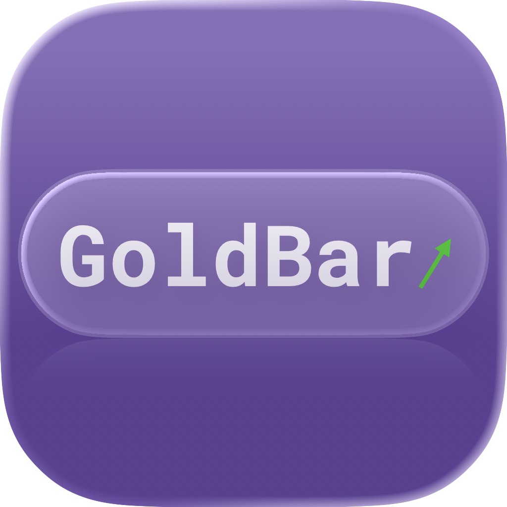

[EN](./README.md) | 中文 | [Dev](./DEVELOPER.md) | [开发者](./DEVELOPER_CN.md)

<p align="center"></p>

# GoldBar — 实时金价菜单栏应用

在 macOS 菜单栏中实时显示当前黄金价格（人民币/克），含涨跌百分比。

## 功能特性

- 🟡 **实时金价** — 菜单栏显示最新黄金价格 (RMB/g)，附带涨跌箭头和百分比
- 📈 **涨跌着色** — 可切换国际惯例（绿涨红跌）或国内惯例（红涨绿跌）
- 🔄 **双数据源** — HTTP 轮询（省资源）或 WebSocket 实时推送（秒级更新）
- 🌐 **自动汇率** — 自动获取 USD/CNY 汇率，将美元/盎司转换为人民币/克
- 🔤 **可调显示** — 菜单栏文字大小和垂直偏移均可调节
- 🌐 **HTTP 状态接口** — 可选开启本地 HTTP 服务，提供 JSON 格式的实时金价数据
- ⚙️ **无需预置 Key** — 首次启动弹窗引导用户自行输入 API Key
- 💾 **低资源占用** — 后台静默运行
- 🔒 **菜单栏专属** — 不占用 Dock 空间

## 系统要求

- macOS 13.0 (Ventura) 或更高版本
- Apple Silicon (M1/M2/M3/M4) 或 Intel Mac
- 互联网连接

## 开发者

```bash
./test.sh          # 运行测试套件
./build.sh         # Debug 构建（带终端实时日志）
./build.sh release # Release 构建（优化，无日志）
make package       # Release 构建 + DMG 打包
```

## 安装

### Homebrew（推荐）

```bash
brew tap JSYRD/goldbar
brew install goldbar
```

### 下载 DMG

从 [GitHub Releases](https://github.com/JSYRD/GoldBar/releases) 下载最新 `GoldBar-*.dmg`，打开后将 GoldBar 拖入「应用程序」即可。

### 从源码构建

```bash
git clone https://github.com/JSYRD/GoldBar.git
cd GoldBar
./build.sh release
open build/GoldBar.app
```

## 使用说明

### 首次启动

首次启动时会弹出配置窗口，请粘贴从 [AllTick](https://alltick.co) 获取的 API Key，点击「开始使用」即可。Key 保存在本地，后续启动无需重复输入。

### 菜单栏显示

```
Au ¥895.2/g ↑0.50%    ← 绿色(涨) / 红色(跌)，配色可切换
```

### 下拉菜单

| 菜单项 | 说明 |
|--------|------|
| 黄金: $XXXX.XX/oz | 原始美元/盎司价格 |
| 涨跌: ↑↓X.XX% (昨收 $XXXX) | 相对昨日收盘的涨跌幅 |
| 汇率: X.XXXX USD/CNY | 当前使用的汇率 |
| 更新时间: HH:MM:SS | 最后一次成功获取数据的时间 |
| **数据源** ▸ | 二级菜单：HTTP 轮询 / WebSocket 实时推送 |
| **涨跌配色** ▸ | 二级菜单：绿涨红跌(国际) / 红涨绿跌(国内) |
| 立即刷新 (`⌘R`) | 手动触发数据刷新 |
| 设置... (`⌘,`) | 打开设置窗口 |
| 退出 GoldBar (`⌘Q`) | 退出应用 |

### 设置窗口

| 设置项 | 说明 |
|--------|------|
| API Key | AllTick 平台 API 密钥 |
| 数据源 | HTTP 轮询 (每15秒) 或 WebSocket 实时推送 |
| 显示大小 | 菜单栏文字大小 (8–18 pt) |
| 垂直偏移 | 文字在菜单栏中的上下位置 (-4.0–+4.0 pt) |
| 汇率模式 | 自动获取 (每小时) 或手动输入固定汇率 |
| 手动汇率 | 仅在手动模式下启用 |
| HTTP 接口 | 开启后在本机提供 JSON 状态接口 (默认端口 9188) |

修改后点击「保存」即刻生效。界面中 API 配置和 UI 设置之间有两条分割线隔开。

### HTTP 状态接口

在设置中启用后，可通过浏览器或 `curl` 访问：

```bash
curl http://localhost:9188/         # 完整状态
curl http://localhost:9188/price    # 仅金价
curl http://localhost:9188/health   # 健康检查
```

返回 JSON 示例：

```json
{
  "gold": {
    "price_usd_oz": 4193.35,
    "price_rmb_g": 915.1,
    "change_percent": -0.45,
    "change_direction": "down",
    "previous_close": 4212.21
  },
  "exchange_rate": {
    "usd_cny": 6.7876,
    "mode": "auto"
  },
  "connection": {
    "mode": "websocket",
    "state": "connected",
    "last_update": "2026-06-12T02:07:00Z"
  }
}
```

## 数据来源

- **黄金实时价**: [AllTick](https://alltick.co) — 实时贵金属报价 API
- **昨日收盘价**: 同上 K 线接口 (日线 `kline_type=8`)，用于计算涨跌
- **美元汇率**: [Exchange Rate API](https://open.er-api.com) — 免费汇率数据

## 价格计算

```
人民币/克 = (美元/盎司 × USD/CNY汇率) ÷ 31.1034768
涨跌%    = (当前价 - 昨日收盘) ÷ 昨日收盘 × 100%
```

## 常见问题

### Q: 首次启动弹窗提示需要 API Key？
A: GoldBar 不内置 API Key。请前往 [alltick.co](https://alltick.co) 免费注册并获取 Token，粘贴到配置窗口即可。

### Q: 价格显示 `--.-/g` 是什么问题？
A: 表示暂时无法获取金价数据。请检查网络连接、API Key 是否有效、是否超过请求频率限制（免费版每分钟 10 次）。

### Q: HTTP 和 WebSocket 模式有什么区别？
A: HTTP 每 15 秒拉取一次，资源占用低。WebSocket 维持长连接，收到实时推送后秒级更新。可随时在菜单栏「数据源」子菜单中切换。

### Q: 涨跌为什么没有百分比？
A: 需要先获取昨日收盘价作为基准。首次启动后等待 K 线数据拉取完成（通常在首次刷新后几秒内）。

### Q: 涨跌颜色不对？
A: 在菜单栏「涨跌配色」子菜单中切换国际/国内配色方案。
